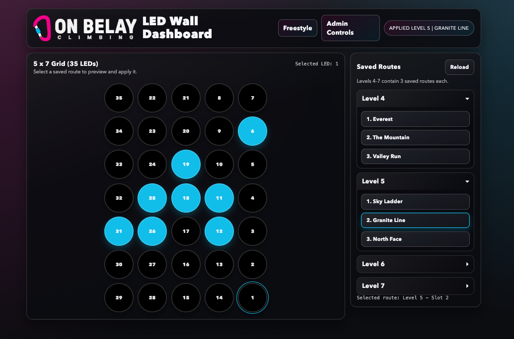

# Open soource project for a SMART WALL

ESP32 + FastAPI + Web UI controller for a climbing wall prototype. Developed this software for a local Rock Climbing gym (On Belay Climbing, based on the Gold Coast). Feel free to clone this repo and use the code in your own project.





## Current architecture

- **Firmware (`../src/main.cpp`)**
  - Drives a 5x7 wall (35 LEDs) with FastLED.
  - Accepts the same command protocol over:
    - USB serial (`115200`)
    - HTTP on ESP32 LAN IP (`GET /cmd?q=<COMMAND>`)
- **Backend (`server.py`)**
  - Serves UI and forwards API requests to either serial or Wi‑Fi transport.
  - UI routes:
    - Dashboard: `/`
    - Admin controls: `/admin`
  - Persists route slots in `python-stuff/data/routes.json`.
  - Transport drivers:
    - `ledwall/serial_controller.py`
    - `ledwall/wifi_controller.py`
- **Frontend (`web/`)**
  - Dashboard (`/`): route browsing/apply + 5x7 wall preview.
  - Admin (`/admin`): full controls, route editing, and transport selector.

## ESP32 Wi-Fi (station mode)

- ESP32 joins an existing 2.4 GHz network using credentials from `include/wifi_secrets.h`.
- Keep credentials out of git by copying `include/wifi_secrets.example.h` to `include/wifi_secrets.h` locally.
- ESP32 host IP comes from your router DHCP lease (for example `192.168.1.120`).

## Command protocol

All commands return one line starting with `OK` or `ERR`.

- `PING`
- `INFO`
- `BRIGHT <0-255>`
- `FILL <r> <g> <b>`
- `SET <i> <r> <g> <b>`
- `SETN <i> <r> <g> <b>`
- `SHOW`
- `CLEAR`

## Run locally

From `python-stuff/`:

```bash
python3 -m venv .venv
source .venv/bin/activate
pip install -r requirements.txt
python3 -m uvicorn server:app --reload --port 8000
```

Open:
- Dashboard: `http://127.0.0.1:8000/`
- Admin: `http://127.0.0.1:8000/admin`

## Flash firmware

From repo root:

```bash
pio run -t upload
```

Before uploading, configure local Wi-Fi credentials:

```bash
cp include/wifi_secrets.example.h include/wifi_secrets.h
```

## Backend API highlights

- `GET /api/ports` list serial ports
- `POST /api/connect` connect transport
  - Serial: `{"transport":"serial","port":"/dev/cu.usbmodem..."}`
  - Wi‑Fi: `{"transport":"wifi","host":"192.168.1.120"}`
- `POST /api/disconnect`
- `GET /api/status`
- `GET/POST /api/color-order` (`rgb`, `grb`, `gbr`, etc.)
- `POST /api/brightness`, `POST /api/fill`, `POST /api/set`, `POST /api/frame`, `POST /api/clear`
- Routes:
  - `GET /api/routes` list levels + route slot names
  - `GET /api/routes/{level}/{slot}` get route payload (includes frame)
  - `POST /api/routes/{level}/{slot}/apply` light route on wall
  - `PUT /api/routes/{level}/{slot}` save a slot (`name`, `frame`, `pin`)

## Route editing security

- Setter route edits are gated by `LED_ROUTE_EDITOR_PIN` 
- Override with:

```bash
export LED_ROUTE_EDITOR_PIN=your-pin
```


